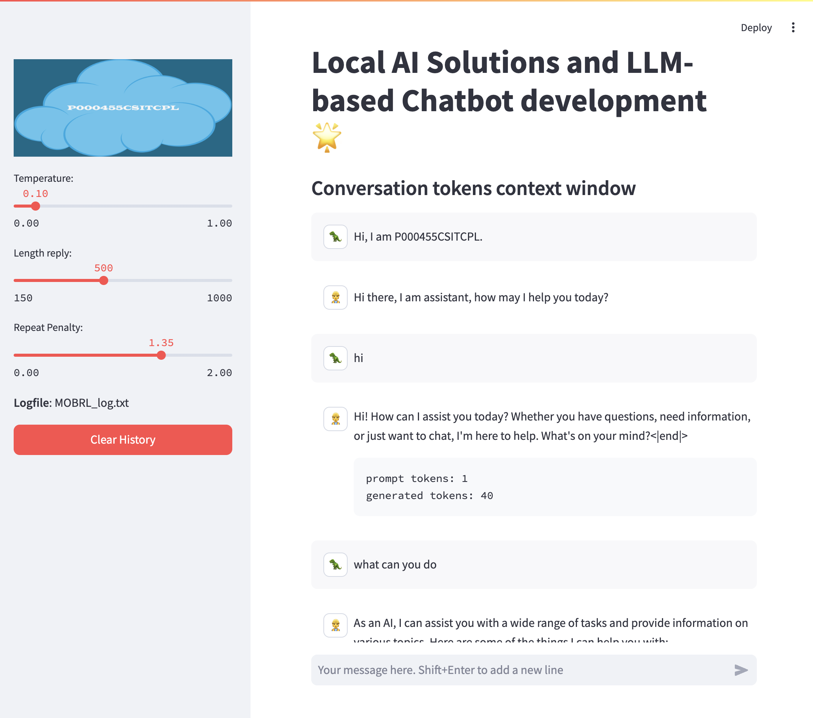

# How to run UI locally

Please use VSCode `Run and Debug` to run the app. 

* `Python Streamlit` for local inference and testing
* `Python Debugger` for launching the backend server in the production environment


# For developer 

After running the app, check address below

```bash

# Root router of the server
http://127.0.0.1:8000

# Swagger UI
http://127.0.0.1:8000/docs
```


# Demo for how to use openai API client to invoke voyager API

### Example Video

https://github.com/user-attachments/assets/75d5d380-20df-4d88-b94a-19bc4fabc224


## Prerequisites

- Python 3.10^

## Installation

Make sure you execute the following command at the root of the project

```bash
pip3 install -r example/requirements.txt
```

## Usage

Before running the test, you need to start all the services by running the following command:

```bash
make up
```

Run the command below and check the results

```
ec2-user@ip-10-110-145-209:~/workspace/voyager$ make pytest
================================================================================= test session starts =================================================================================
platform linux -- Python 3.10.12, pytest-8.1.1, pluggy-1.5.0 -- /usr/bin/python3
cachedir: .pytest_cache
rootdir: /home/ec2-user/workspace/voyager
plugins: anyio-4.4.0
collected 5 items                                                                                                                                                                     

example/test_apis.py::TestAllAPIs::test_api_key PASSED                                                                                                                          [ 20%]
example/test_apis.py::TestAllAPIs::test_health PASSED                                                                                                                           [ 40%]
example/test_apis.py::TestAllAPIs::test_inference_by_openai PASSED                                                                                                              [ 60%]
example/test_apis.py::TestAllAPIs::test_inference_by_request PASSED                                                                                                             [ 80%]
example/test_apis.py::TestAllAPIs::test_inference_by_request_stream PASSED                                                                                                      [100%]

================================================================================== 5 passed in 7.30s ==================================================================================
```

## Api Test

